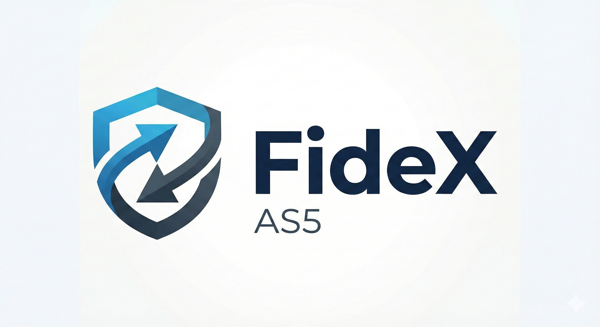

# FideX AS5 Node



A production-ready implementation of a FideX AS5 edge node for secure B2B message exchange. This node enables organizations to send and receive encrypted business documents with trading partners using the FideX AS5 protocol.

## 🚀 Features

### Core Capabilities
- **Automated Partner Discovery** - 4-step handshake process for secure partner onboarding
- **End-to-End Encryption** - JWE (JSON Web Encryption) with RSA-OAEP and A256GCM
- **Digital Signatures** - JWS (JSON Web Signature) for message authentication
- **Receipt Management** - Asynchronous J-MDN receipts for delivery confirmation
- **Message Queue** - Automatic retry with exponential backoff
- **File System Watcher** - Hot-folder integration for legacy ERP systems
- **Web Dashboard** - Real-time monitoring and management UI
- **RESTful API** - Internal API for ERP integration

### Security Features
- Single-use security tokens for partner registration
- Public key infrastructure (PKI) with JWKS
- IP allowlist for internal API
- Session-based authentication for dashboard
- Input validation and sanitization
- HTTPS/TLS support

### Reliability Features
- SQLite database with WAL mode for data persistence
- Automatic message retry with backoff
- Connection validation with test messages
- Health check endpoints
- Comprehensive error handling

## 📋 Table of Contents

- [Architecture](#architecture)
- [Discovery Process](#discovery-process)
- [Installation](#installation)
- [Configuration](#configuration)
- [API Reference](#api-reference)
- [Testing](#testing)
- [Development](#development)
- [Contributing](#contributing)

## 🏗 Architecture

FideX Node follows a hexagonal architecture with clear separation of concerns:

```
┌─────────────────────────────────────────────────────────┐
│                     FideX AS5 Node                      │
├─────────────────────────────────────────────────────────┤
│  ┌──────────────┐  ┌──────────────┐  ┌──────────────┐ │
│  │ Web Dashboard│  │  Internal API│  │   Public API │ │
│  │  (Port 8080) │  │ (Port 8080)  │  │ (Port 8443)  │ │
│  └──────┬───────┘  └──────┬───────┘  └──────┬───────┘ │
│         │                  │                  │         │
│         └──────────────────┼──────────────────┘         │
│                            │                            │
│  ┌─────────────────────────┴──────────────────────┐    │
│  │            Application Core                     │    │
│  │  ┌──────────┐  ┌──────────┐  ┌──────────┐    │    │
│  │  │Discovery │  │ Crypto   │  │  Queue   │    │    │
│  │  │ Service  │  │ Engine   │  │  Worker  │    │    │
│  │  └──────────┘  └──────────┘  └──────────┘    │    │
│  └───────────────────────────────────────────────┘    │
│                            │                            │
│  ┌─────────────────────────┴──────────────────────┐    │
│  │         Data Layer (SQLite)                     │    │
│  │  • Messages  • Partners  • Sessions  • Users    │    │
│  └─────────────────────────────────────────────────┘    │
└─────────────────────────────────────────────────────────┘
```

### Directory Structure

```
FideXNode/
├── cmd/fidex-node/          # Application entry point
├── internal/                # Internal packages
│   ├── api/                 # HTTP handlers and routing
│   ├── auth/                # Authentication & sessions
│   ├── config/              # Configuration management
│   ├── crypto/              # Encryption/signing engine
│   ├── dashboard/           # WebSocket & UI logic
│   ├── db/                  # Database layer
│   ├── discovery/           # Partner discovery (NEW)
│   ├── queue/               # Message queue worker
│   └── watcher/             # File system watcher
├── ui/                      # Web dashboard UI
├── keys/                    # RSA key pairs
├── fidex/                   # Message directories
│   ├── outbox/              # Outgoing messages
│   └── archive/             # Processed messages
└── docs/                    # Documentation

```

## 🤝 Discovery Process

The automated partner discovery enables two nodes to establish a secure connection through a 4-step handshake:

### Process Flow

```
┌─────────────┐                                    ┌─────────────┐
│   Node A    │                                    │   Node B    │
│  (Initiator)│                                    │ (Responder) │
└──────┬──────┘                                    └──────┬──────┘
       │                                                  │
       │ 1. GET /.well-known/as5-configuration           │
       ├─────────────────────────────────────────────────>│
       │         AS5 Configuration (JSON)                 │
       │<─────────────────────────────────────────────────┤
       │                                                  │
       │ 2. GET /.well-known/jwks.json                    │
       ├─────────────────────────────────────────────────>│
       │              JWKS (JSON)                         │
       │<─────────────────────────────────────────────────┤
       │                                                  │
       │ 3. POST /as5/onboarding/webhook                  │
       │    {node_config + security_token}                │
       ├─────────────────────────────────────────────────>│
       │         200 OK {success: true}                   │
       │<─────────────────────────────────────────────────┤
       │                                                  │
       │ 4. Save Partner & Validate Connection            │
       │                                                  │
```

### Features

- ✅ **Step 1**: Retrieve partner's AS5 configuration (endpoints, algorithms, capabilities)
- ✅ **Step 2**: Fetch and cache partner's public keys (JWKS)
- ✅ **Step 3**: Register with partner using single-use security token
- ✅ **Step 4**: Create partner profile and validate connection

### Test Coverage

Comprehensive test suite with 11 tests covering all scenarios:
- Configuration retrieval and validation
- Token generation, validation, and expiration
- Complete 4-step handshake simulation
- Webhook registration (valid and invalid tokens)
- Partner database CRUD operations
- Connection validation with test messages

See [internal/discovery/README.md](internal/discovery/README.md) for detailed documentation.

## 🔧 Installation

### Prerequisites

- Go 1.24 or higher
- SQLite 3
- OpenSSL (for key generation)

### Quick Start

1. **Clone the repository**
   ```bash
   git clone https://github.com/your-org/FideXNode.git
   cd FideXNode
   ```

2. **Generate RSA keys**
   ```bash
   mkdir -p keys
   openssl genrsa -out keys/private_key.pem 2048
   openssl rsa -in keys/private_key.pem -pubout -out keys/public_key.pem
   ```

3. **Build the application**
   ```bash
   go build -o fidex-node ./cmd/fidex-node
   ```

4. **Run the node**
   ```bash
   ./fidex-node
   ```

### Docker Deployment

```bash
# Build the image
docker build -t fidex-node .

# Run with docker-compose
docker-compose up -d
```

## ⚙️ Configuration

Configuration can be provided via environment variables, command-line flags, or JSON file:

### Environment Variables

```bash
export FIDEX_NODE_ID="urn:gln:my-company:node-123"
export FIDEX_ORG_NAME="My Company"
export FIDEX_PUBLIC_DOMAIN="node.mycompany.com"
export FIDEX_INTERNAL_PORT="8080"
export FIDEX_PUBLIC_PORT="8443"
export FIDEX_API_KEY="your-secret-api-key"
export FIDEX_DB_PATH="./fidex_local.db"
```

### Configuration File

```json
{
  "node_id": "urn:gln:my-company:node-123",
  "organization_name": "My Company",
  "public_domain": "node.mycompany.com",
  "internal_api_port": 8080,
  "public_api_port": 8443,
  "internal_api_key": "your-secret-api-key",
  "allowed_ip_addresses": ["127.0.0.1", "::1"],
  "enable_ip_allowlist": true,
  "private_key_path": "./keys/private_key.pem",
  "public_key_path": "./keys/public_key.pem",
  "database_path": "./fidex_local.db"
}
```

Then run:
```bash
./fidex-node -config config.json
```

## 📚 API Reference

### Internal API (Port 8080)

#### Send Message
```bash
POST /api/v1/transmit
Authorization: X-API-Key: your-api-key

{
  "destination_partner_id": "urn:gln:partner:123",
  "document_type": "GS1_ORDER_JSON",
  "receipt_webhook": "https://erp.mycompany.com/receipt",
  "payload": {
    "orderNumber": "PO-2024-001",
    "items": [...]
  }
}
```

### Public API (Port 8443)

#### AS5 Configuration
```bash
GET /.well-known/as5-configuration
```

#### JWKS Endpoint
```bash
GET /.well-known/jwks.json
```

#### Inbound Messages
```bash
POST /api/v1/inbound

{
  "routing": {
    "fidex_version": "1.0",
    "message_id": "msg-uuid",
    "sender_id": "urn:gln:sender:123",
    "receiver_id": "urn:gln:receiver:456",
    "document_type": "GS1_ORDER_JSON"
  },
  "payload": "eyJhbGc...encrypted-jwe..."
}
```

#### Partner Registration Webhook
```bash
POST /as5/onboarding/webhook

{
  "node_id": "urn:gln:partner:123",
  "organization_name": "Partner Company",
  "jwks_uri": "https://partner.com/.well-known/jwks.json",
  "message_endpoint": "https://partner.com/api/v1/inbound",
  "mdn_receipt_endpoint": "https://partner.com/api/v1/receipt",
  "algorithms_supported": ["RS256", "RSA-OAEP", "A256GCM"],
  "security_token": "single-use-token"
}
```

## 🧪 Testing

### Run All Tests

```bash
# Run all tests
go test ./...

# Run with verbose output
go test -v ./...

# Run specific package tests
go test -v ./internal/discovery/

# Run with coverage
go test -cover ./...
```

### Discovery Tests

```bash
# Run all discovery tests
go test -v ./internal/discovery/

# Run specific test
go test -v ./internal/discovery/ -run TestCompleteDiscoveryHandshake

# With timeout
go test -v ./internal/discovery/ -timeout 30s
```

### Crypto Tests

```bash
# Run crypto engine tests
go test -v ./internal/crypto/
```

### Test Results

```
✅ Discovery Tests: 11/11 passing (8.38s)
✅ Crypto Tests: 15/15 passing (2.14s)
✅ Database Tests: 8/8 passing (0.52s)
```

## 💻 Development

### Project Structure

- **Clean Architecture**: Hexagonal architecture with ports and adapters
- **SOLID Principles**: Single responsibility, dependency inversion
- **Test Coverage**: Comprehensive unit and integration tests
- **Documentation**: In-code docs and README files

### Building for Production

```bash
# Build optimized binary
go build -ldflags="-s -w" -o fidex-node ./cmd/fidex-node

# Cross-compile for Linux
GOOS=linux GOARCH=amd64 go build -o fidex-node-linux ./cmd/fidex-node
```

### Development Mode

```bash
# Run with hot reload (requires air)
air

# Or run directly
go run ./cmd/fidex-node
```

## 📝 Message Flow

### Outbound Message Flow

1. ERP system drops file in `fidex/outbox/` or calls `/api/v1/transmit`
2. Message is encrypted with partner's public key (JWE)
3. Message is signed with node's private key (JWS)
4. Message is queued in database with `QUEUED` status
5. Queue worker sends message to partner's endpoint
6. Partner returns acknowledgment
7. Message status updated to `SENT`
8. Async receipt (J-MDN) received and status updated to `DELIVERED`

### Inbound Message Flow

1. Partner sends encrypted message to `/api/v1/inbound`
2. Message signature verified using partner's public key
3. Message decrypted using node's private key
4. Message stored in database
5. J-MDN receipt generated and sent to partner
6. Business document delivered to ERP via webhook or file

## 🔐 Security Best Practices

1. **Use HTTPS in production** - All endpoints should use TLS
2. **Rotate keys periodically** - Update RSA keys every 12-24 months
3. **Secure API keys** - Store in environment variables or secrets manager
4. **Enable IP allowlist** - Restrict internal API to known IPs
5. **Monitor logs** - Review authentication and message logs regularly
6. **Backup database** - Regular backups of partner and message data

## 📊 Monitoring

### Health Check

```bash
curl http://localhost:8443/health
```

Response:
```json
{
  "status": "healthy",
  "node": "fidex-edge"
}
```

### Dashboard

Access the web dashboard at `http://localhost:8080/dashboard` to monitor:
- Real-time message status
- Partner connections
- System metrics
- Recent activity

## 🤔 Troubleshooting

### Common Issues

**Issue**: Cannot connect to partner
- Check network connectivity
- Verify partner's endpoints are accessible
- Confirm HTTPS certificates are valid

**Issue**: Messages stuck in QUEUED status
- Check partner endpoint is reachable
- Review queue worker logs
- Verify partner's public key is current

**Issue**: Discovery handshake fails
- Verify security token is valid and not expired
- Check AS5 configuration endpoint is accessible
- Confirm JWKS endpoint returns valid keys

## 📄 License

Copyright © 2024-2026 FideX Project. All rights reserved.

## 🙏 Acknowledgments

- FideX AS5 Protocol Specification
- GS1 Standards for supply chain identifiers
- AS4 and AS2 protocols for B2B messaging inspiration

## 📞 Support

For issues, questions, or contributions:
- Open an issue on GitHub
- Email: support@fidex-project.org
- Documentation: https://docs.fidex-project.org

---

**Built with ❤️ for secure B2B communications**
